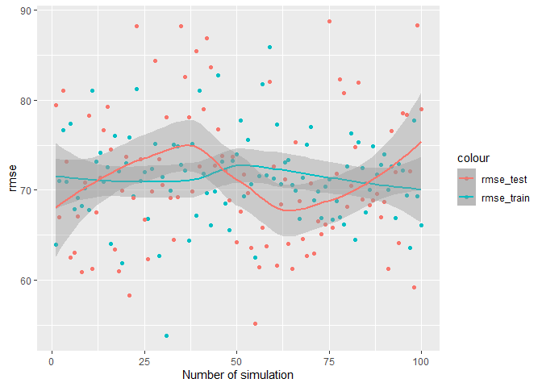
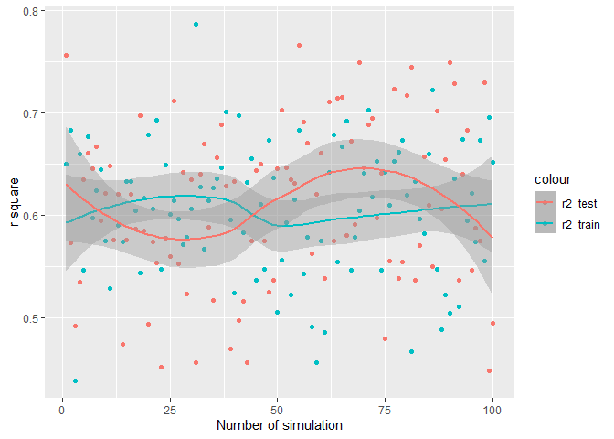

PM591 Assignment01
================
NickyNie
1/26/2022

``` r
options(scipen = 1, digits = 4)
```

## Analysis

## 1. Re-analysis of the brain weight data

1.  Read in (`read.table`) the Brain weight dataset. Examine (`head`)
    and summarize (`summary`) the data.

``` r
brain <- read.table("brain.csv", header = TRUE)
head(brain)
```

    ##   Sex Age Head.size Brain.weight
    ## 1   1   1      4512         1530
    ## 2   1   1      3738         1297
    ## 3   1   1      4261         1335
    ## 4   1   1      3777         1282
    ## 5   1   1      4177         1590
    ## 6   1   1      3585         1300

``` r
summary(brain)
```

    ##       Sex            Age         Head.size     Brain.weight 
    ##  Min.   :1.00   Min.   :1.00   Min.   :2720   Min.   : 955  
    ##  1st Qu.:1.00   1st Qu.:1.00   1st Qu.:3389   1st Qu.:1207  
    ##  Median :1.00   Median :2.00   Median :3614   Median :1280  
    ##  Mean   :1.43   Mean   :1.54   Mean   :3634   Mean   :1283  
    ##  3rd Qu.:2.00   3rd Qu.:2.00   3rd Qu.:3876   3rd Qu.:1350  
    ##  Max.   :2.00   Max.   :2.00   Max.   :4747   Max.   :1635

2.  Convert Sex and Age to factor variables so that `lm` can properly
    deal with them.

``` r
brain$Sex <- factor(brain$Sex, levels = 1:2, labels = c("Male","Female"))
brain$Age <- factor(brain$Age, levels = 1:2, labels = c("20-46","46+"))
```

3.  Split the data into training (70%) and test (30%) sets.

``` r
set.seed(2018)
n <- nrow(brain)
trainset <- sample(1:n, floor(0.7*n))
brain_train <- brain[trainset,]
brain_test <- brain[-trainset,]
```

4.  Fit a linear regression model with brain weight as the outcome and
    head Size, Sex, and Age as predictors. What is the interpretation of
    the coefficients for Sex and Age? Compute the training and test RMSE
    and *R*<sup>2</sup>. Does adding Age improves *prediction
    performance* over the model with Sex and Head size alone?

``` r
model_alone <- lm(Brain.weight~Sex+Head.size, data = brain_train)
RMSE_train_alone <-sqrt(sum(residuals(model_alone)^2)/nrow(brain_train))
RSS_alone <- sum(residuals(model_alone)^2)
TSS_alone <- sum((brain_train$Brain.weight-mean(brain_train$Brain.weight))^2)
R2_train_alone <- 1-RSS_alone/TSS_alone
pred_alone <- predict(model_alone, newdata = brain_test)
RMSE_test_alone <- sqrt(sum((brain_test$Brain.weight-pred_alone)^2)/nrow(brain_test))
R2_test_alone <- 1-sum((brain_test$Brain.weight-pred_alone)^2)/sum((brain_test$Brain.weight-mean(brain_test$Brain.weight))^2)
```

``` r
model_all <- lm(Brain.weight~Sex+Head.size+Age, data = brain_train)
coef(model_all)
```

    ## (Intercept)   SexFemale   Head.size      Age46+ 
    ##    482.4972    -21.3368      0.2264    -25.0911

``` r
RMSE_train_all <-sqrt(sum(residuals(model_all)^2)/nrow(brain_train))
RSS_all <- sum(residuals(model_all)^2)
TSS_all <- sum((brain_train$Brain.weight-mean(brain_train$Brain.weight))^2)
R2_train_all <- 1-RSS_all/TSS_all
pred_all <- predict(model_all, newdata = brain_test)
RMSE_test_all <- sqrt(sum((brain_test$Brain.weight-pred_all)^2)/nrow(brain_test))
R2_test_all <- 1-sum((brain_test$Brain.weight-pred_all)^2)/sum((brain_test$Brain.weight-mean(brain_test$Brain.weight))^2)
```

``` r
tab_rmse <- data.frame(RMSE_train_all,RMSE_train_alone,RMSE_test_all,RMSE_test_alone)
knitr::kable(tab_rmse)
```

| RMSE_train_all | RMSE_train_alone | RMSE_test_all | RMSE_test_alone |
|---------------:|-----------------:|--------------:|----------------:|
|          70.64 |            71.69 |         72.07 |           73.06 |

``` r
tab_r2 <- data.frame(R2_train_all,R2_train_alone,R2_test_all,R2_test_alone)
knitr::kable(tab_r2)
```

| R2_train_all | R2_train_alone | R2_test_all | R2_test_alone |
|-------------:|---------------:|------------:|--------------:|
|       0.5895 |         0.5773 |      0.7348 |        0.7275 |

The interpretation of coefficients of Age and Sex is that Brain size
will increase in 0.2264196 unit as sex increases in one unit and Brain
size will decrease in 25.0911009 units as age increases in one unit.
Adding Age improves prediction performance over the model with Sex and
Head size alone

5.  Explore whether fitting a linear regression model with separate
    intercepts and separate slopes for 20≤ Age \< 46 and Age ≥ 46
    improves prediction performance over the model *Brain.weight \~
    Age + Brain.size* (hint: you can, for example, specify an
    interaction between Sex and Head size including `Head.Size:Age` in
    the model formula.

``` r
model3 <- lm(Brain.weight~Age+Head.size+Head.size:Age, data = brain_train)
RMSE_train3 <-sqrt(sum(residuals(model3)^2)/nrow(brain_train))
RSS3 <- sum(residuals(model3)^2)
TSS3 <- sum((brain_train$Brain.weight-mean(brain_train$Brain.weight))^2)
R2_train3 <- 1-RSS3/TSS3
pred3 <- predict(model3, newdata = brain_test)
RMSE_test3 <- sqrt(sum((brain_test$Brain.weight-pred3)^2)/nrow(brain_test))
R2_test3 <- 1-sum((brain_test$Brain.weight-pred3)^2)/sum((brain_test$Brain.weight-mean(brain_test$Brain.weight))^2)
```

``` r
model3_alone <- lm(Brain.weight~Age+Head.size, data = brain_train)
RMSE_train3_alone <-sqrt(sum(residuals(model3_alone)^2)/nrow(brain_train))
RSS3_alone <- sum(residuals(model3_alone)^2)
TSS3_alone <- sum((brain_train$Brain.weight-mean(brain_train$Brain.weight))^2)
R2_train3_alone <- 1-RSS3_alone/TSS3_alone
pred3_alone <- predict(model3_alone, newdata = brain_test)
RMSE_test3_alone <- sqrt(sum((brain_test$Brain.weight-pred3_alone)^2)/nrow(brain_test))
R2_test3_alone <- 1-sum((brain_test$Brain.weight-pred3_alone)^2)/sum((brain_test$Brain.weight-mean(brain_test$Brain.weight))^2)
```

``` r
tab_rmse <- data.frame(RMSE_train3,RMSE_train3_alone,RMSE_test3,RMSE_test3_alone)
knitr::kable(tab_rmse)
```

| RMSE_train3 | RMSE_train3_alone | RMSE_test3 | RMSE_test3_alone |
|------------:|------------------:|-----------:|-----------------:|
|       70.97 |             71.25 |      73.34 |            72.91 |

``` r
tab_r2 <- data.frame(R2_train3,R2_train3_alone,R2_test3,R2_test3_alone)
knitr::kable(tab_r2)
```

| R2_train3 | R2_train3_alone | R2_test3 | R2_test3_alone |
|----------:|----------------:|---------:|---------------:|
|    0.5858 |          0.5825 |   0.7254 |         0.7286 |

It improves in trainset but not in testset.

6.  Compare your results from e. to fitting two separate models:
    Brain.weight \~ Age + Brain.size for individuals 20≤ Age \< 46 and
    \`Brain.weight \~ Age + Brain.size\`\` for individuals Age ≥ 46. Is
    this equivalent to the single model you fitted in e.? Explain (hint:
    think about the residual sum of squares being minimized in each case
    to obtain the model coefficients).

``` r
brain_train_young <- dplyr::filter(brain_train, brain_train$Age=="20-46")
brain_test_young <- dplyr::filter(brain_test, brain_test$Age=="20-46")
model4 <- lm(Brain.weight~Head.size, data = brain_train_young)
```

``` r
brain_train_old <- dplyr::filter(brain_train, brain_train$Age=="46+")
brain_test_old <- dplyr::filter(brain_test, brain_test$Age=="46+")
model5 <- lm(Brain.weight~Head.size, data = brain_train_old)
```

``` r
summary(model3_alone)
```

    ## 
    ## Call:
    ## lm(formula = Brain.weight ~ Age + Head.size, data = brain_train)
    ## 
    ## Residuals:
    ##    Min     1Q Median     3Q    Max 
    ## -152.7  -43.2    0.0   41.7  257.1 
    ## 
    ## Coefficients:
    ##             Estimate Std. Error t value Pr(>|t|)    
    ## (Intercept) 421.0135    60.3974    6.97  7.6e-11 ***
    ## Age46+      -21.7441    11.3493   -1.92    0.057 .  
    ## Head.size     0.2403     0.0163   14.76  < 2e-16 ***
    ## ---
    ## Signif. codes:  0 '***' 0.001 '**' 0.01 '*' 0.05 '.' 0.1 ' ' 1
    ## 
    ## Residual standard error: 71.9 on 162 degrees of freedom
    ## Multiple R-squared:  0.582,  Adjusted R-squared:  0.577 
    ## F-statistic:  113 on 2 and 162 DF,  p-value: <2e-16

``` r
summary(model4)
```

    ## 
    ## Call:
    ## lm(formula = Brain.weight ~ Head.size, data = brain_train_young)
    ## 
    ## Residuals:
    ##     Min      1Q  Median      3Q     Max 
    ## -152.36  -54.25    5.25   38.46  237.71 
    ## 
    ## Coefficients:
    ##             Estimate Std. Error t value Pr(>|t|)    
    ## (Intercept) 503.7849    99.9011    5.04  3.6e-06 ***
    ## Head.size     0.2178     0.0271    8.04  1.9e-11 ***
    ## ---
    ## Signif. codes:  0 '***' 0.001 '**' 0.01 '*' 0.05 '.' 0.1 ' ' 1
    ## 
    ## Residual standard error: 75.7 on 68 degrees of freedom
    ## Multiple R-squared:  0.487,  Adjusted R-squared:  0.48 
    ## F-statistic: 64.6 on 1 and 68 DF,  p-value: 1.89e-11

``` r
summary(model5)
```

    ## 
    ## Call:
    ## lm(formula = Brain.weight ~ Head.size, data = brain_train_old)
    ## 
    ## Residuals:
    ##    Min     1Q Median     3Q    Max 
    ## -161.3  -49.3    2.7   40.1  253.4 
    ## 
    ## Coefficients:
    ##             Estimate Std. Error t value Pr(>|t|)    
    ## (Intercept) 344.7871    73.4016     4.7  9.1e-06 ***
    ## Head.size     0.2554     0.0201    12.7  < 2e-16 ***
    ## ---
    ## Signif. codes:  0 '***' 0.001 '**' 0.01 '*' 0.05 '.' 0.1 ' ' 1
    ## 
    ## Residual standard error: 68.9 on 93 degrees of freedom
    ## Multiple R-squared:  0.633,  Adjusted R-squared:  0.629 
    ## F-statistic:  161 on 1 and 93 DF,  p-value: <2e-16

They are different since coefficients are obtained by minimizing
residual sum of squares, when more data evolved in the model, residual
sum of squares of the original model will increase and maynot be the
minimum one, hence the coefficients will change and then prodece a new
model.

## 2. Write a R function Rsq to compute *R*<sup>2</sup>.

The function should take two vector arguments observed and predicted and
return *R*<sup>2</sup>. Given the correct inputes it should be able to
compute training and test *R*<sup>2</sup>s.

``` r
Rsq <- function(obs,pred){
  RSS = sum((obs-pred)^2)
  TSS = sum((obs-mean(obs))^2)
  R2 = 1-RSS/TSS
}
```

# Simulation

## 1.Simulation study

You will perform a small simulation study to investigate the degree to
which assessing prediction performance in *the same data* used to
train/fit a model – rather than using a separate test dataset – leads to
an overly optimistic assessment of prediction performance. Of particular
interest is to investigate how the degree of overoptimistic assessment
is affected by i) the size of the training data and ii) the level of
noise in the data. The simulation will loosely mimic the brain weight
data.

1.  Set the training sample size to `n_train=100`, the test sample size
    to `n_test=50`, and the total sample size to
    `n = n_train + n_test = 150` (the train/test split is 2/3 train to
    1/3 test rather than the more usual 0.8 to 0.2 to prevent the test
    set from being too small).

``` r
n_train <- 100
n_test <- 50
n <- n_train + n_test
```

2.  Generate a variable/vector `Head.size` of size `n` drawn from a
    normal distribution with population mean and population standard
    deviations equal to the sample mean and sample standard deviation,
    respectively, of the Head.Size variable in the real brain weight
    data.

``` r
Head.size <- rnorm(n, mean = mean(brain$Head.size), sd = sd(brain$Head.size))
```

3.  Generate a binary variable/vector `Sex`= Female/Male of size `n`
    with a population frequency of Sex==Female/Male matching the
    observed frequencies of the variable Sex in the real brain weight
    data (hint: use `rbinom` to generate samples form a binomial
    distribution: `rbinom(n, size=1, prob=Malefreq)`, where `Malefreq`
    was previously computed).

``` r
Malefreq <- sum(brain$Sex == "Male")/length(brain$Sex)
Sex <- rbinom(n, size = 1, prob = Malefreq)
```

4.  Similarly, generate a binary variable/vector `Age`= \<= 46/ > 46
    with population frequencies for \<= 46 and > 46 matching the
    observed frequencies of the variable Age in the the real brain
    weight data.

``` r
youngfreq <- sum(brain$Age == "20-46")/length(brain$Age)
Age <- rbinom(n, size = 1, prob = youngfreq)
```

5.  Generate a variable/vector `Brain.weight` of size `n` according to
    the linear model
    `Brain.weight = b0 + ba * Age + bs * Sex + bh * Head.size`. Use the
    coefficients beta_0, beta\_{A}, beta_S, and beta_H obtained from
    fitting the corresponding linear regression model to the full real
    brain weight dataset.

``` r
lm_model <- lm(Brain.weight~Age+Sex+Head.size, data = brain)
beta_0 <- summary(lm_model)$coefficients[1,1]
beta_A <- summary(lm_model)$coefficients[2,1]
beta_S <- summary(lm_model)$coefficients[3,1]
beta_H <- summary(lm_model)$coefficients[4,1]
Brain.weight <- beta_0 + beta_A*Age + beta_S*Sex + beta_H * Head.size
```

6.  Generate a noise/error vector `noise` of size `n` drawn from a
    normal distribution with mean 0 and variance equal to that of the
    residual variance in the linear regression model fitted above on the
    full real brain weight dataset. Add the noise to Brain.weight:
    `Brain.weight = Brain.weight + noise`.

``` r
noise <- rnorm(n, mean=0, sd = summary(lm_model)$sigma)
Brain.weight <- Brain.weight + noise
```

7.  Construct a dataframe containing the generated variables `Sex`,
    `Age`, `Brain.weight`, and `Head.size`

``` r
brain_new <- data.frame(Sex, Age, Brain.weight, Head.size)
```

8.  Split the data into training (`size n_train`) and test
    (`size n_test`) sets.

``` r
train <- sample(1:n, n_train)
train_set <- brain_new[train,]
test_set <- brain_new[-train,]
```

9.  Fit the model
    `Brain.weight ~ b0 + ba * Age + bs * Sex + bh * Head.size` to the
    training data.

``` r
model2 <- function(Sex, Age, Head.size){
  pred = beta_0 + beta_A*Age + beta_S*Sex + beta_H*Head.size
}
```

``` r
rmse <- function(obs,pred){
  sqrt(mean((obs-pred)^2))
}
```

``` r
train_set$pred <- model2(train_set$Sex, train_set$Age, train_set$Head.size)
test_set$pred <- model2(test_set$Sex, test_set$Age, test_set$Head.size)
```

10. Compute the training and test RMSE and *R*<sup>2</sup>.

``` r
rmse_train <- rmse(train_set$Brain.weight, train_set$pred)
r2_train <- Rsq(train_set$Brain.weight, train_set$pred)
rmse_test <- rmse(test_set$Brain.weight, test_set$pred)
r2_test <- Rsq(test_set$Brain.weight, test_set$pred)
tab <- data.frame(rmse_train, rmse_test, r2_train, r2_test)
knitr::kable(tab)
```

| rmse_train | rmse_test | r2_train | r2_test |
|-----------:|----------:|---------:|--------:|
|      73.91 |     57.16 |   0.5813 |  0.7233 |

11. Repeat steps 2 to 10 100 times (save the RMSE’s and
    *R*<sup>2</sup>’s from each simulation replicate).

``` r
result <- data.frame(1:100,0,0,0,0)
colnames(result) <- c("NO_sim","rmse_train", "rmse_test", "r2_train", "r2_test")
for (i in 1:100){
  Head.size <- rnorm(n, mean = mean(brain$Head.size), sd = sd(brain$Head.size))
  Malefreq <- sum(brain$Sex == "Male")/length(brain$Sex)
Sex <- rbinom(n, size = 1, prob = Malefreq)
  youngfreq <- sum(brain$Age == "20-46")/length(brain$Age)
  Age <- rbinom(n, size = 1, prob = youngfreq)
  lm_model <- lm(Brain.weight~Age+Sex+Head.size, data = brain)
  beta_0 <- summary(lm_model)$coefficients[1,1]
  beta_A <- summary(lm_model)$coefficients[2,1]
  beta_S <- summary(lm_model)$coefficients[3,1]
  beta_H <- summary(lm_model)$coefficients[4,1]
  Brain.weight <- beta_0 + beta_A*Age + beta_S*Sex + beta_H * Head.size
  noise <- rnorm(n, mean=0, sd = summary(lm_model)$sigma)
  Brain.weight <- Brain.weight + noise
  brain_new <- data.frame(Sex, Age, Brain.weight, Head.size)
  train <- sample(1:n, n_train)
  train_set <- brain_new[train,]
  test_set <- brain_new[-train,]
  model2 <- function(Sex, Age, Head.size){
    pred = beta_0 + beta_A*Age + beta_S*Sex + beta_H*Head.size
  }
  train_set$pred <- model2(train_set$Sex, train_set$Age, train_set$Head.size)
  test_set$pred <- model2(test_set$Sex, test_set$Age, test_set$Head.size)
  rmse_train <- rmse(train_set$Brain.weight, train_set$pred)
  r2_train <- Rsq(train_set$Brain.weight, train_set$pred)
  rmse_test <- rmse(test_set$Brain.weight, test_set$pred)
  r2_test <- Rsq(test_set$Brain.weight, test_set$pred)
  result[i,] <- data.frame(i, rmse_train, rmse_test, r2_train, r2_test)
}
```

12. Compute the average training and test RMSE (*R*<sup>2</sup>) across
    the 100 simulation replicates.

``` r
train_rmse_avg <- mean(result$rmse_train)
train_r2_avg <- mean(result$r2_train)
test_rmse_avg <- mean(result$rmse_test)
test_r2_avg <- mean(result$r2_test)
tab_mean <- data.frame(train_rmse_avg, train_r2_avg, test_rmse_avg, test_r2_avg)
knitr::kable(tab_mean)
```

| train_rmse_avg | train_r2_avg | test_rmse_avg | test_r2_avg |
|---------------:|-------------:|--------------:|------------:|
|          71.34 |       0.6051 |         71.28 |        0.61 |

13. Visually (e.g. scatter plot, boxplot) evaluate the degree of
    optimistic assessment when training and testing on the same data.

``` r
library("ggplot2")
ggplot(data = result)+
  geom_point(mapping = aes(x = NO_sim, y = rmse_train, color = "rmse_train"))+
  geom_point(mapping = aes(x = NO_sim, y = rmse_test, color = "rmse_test"))+
  geom_smooth(mapping = aes(x = NO_sim, y = rmse_train, color = "rmse_train"))+
  geom_smooth(mapping = aes(x = NO_sim, y = rmse_test, color = "rmse_test"))+
  labs(x = "Number of simulation", y = "rmse")
```

    ## `geom_smooth()` using method = 'loess' and formula 'y ~ x'
    ## `geom_smooth()` using method = 'loess' and formula 'y ~ x'

<!-- -->

``` r
ggplot(data = result)+
  geom_point(mapping = aes(x = NO_sim, y = r2_train, color = "r2_train"))+
  geom_point(mapping = aes(x = NO_sim, y = r2_test, color = "r2_test"))+
  geom_smooth(mapping = aes(x = NO_sim, y = r2_train, color = "r2_train"))+
  geom_smooth(mapping = aes(x = NO_sim, y = r2_test, color = "r2_test"))+
  labs(x = "Number of simulation", y = "r square")
```

    ## `geom_smooth()` using method = 'loess' and formula 'y ~ x'
    ## `geom_smooth()` using method = 'loess' and formula 'y ~ x'

<!-- -->

14. Comment on the results of the simulation.

rmse of simulations in train and test are between 65 and 75 and r square
of simulations in train and test are between 0.55 and 0.65. And they are
stable in training set but not stable in testing set probably because of
fewer data in test set.

15. Investigate how the results change as the standard deviation of the
    noise variable `noise` gets larger (say 1.5- and 2-fold lager than
    in the baseline simulation). Summarize and comment on your results.

``` r
result2 <- data.frame(1:10,0,0,0,0,0)
colnames(result2) <- c("NO_sim", "sd_noise" ,"rmse_train", "rmse_test", "r2_train", "r2_test")
for (i in 1:10){
  set.seed(2022)
  Head.size <- rnorm(n, mean = mean(brain$Head.size), sd = sd(brain$Head.size))
  Malefreq <- sum(brain$Sex == "Male")/length(brain$Sex)
  Sex <- rbinom(n, size = 1, prob = Malefreq)
  youngfreq <- sum(brain$Age == "20-46")/length(brain$Age)
  Age <- rbinom(n, size = 1, prob = youngfreq)
  lm_model <- lm(Brain.weight~Age+Sex+Head.size, data = brain)
  beta_0 <- summary(lm_model)$coefficients[1,1]
  beta_A <- summary(lm_model)$coefficients[2,1]
  beta_S <- summary(lm_model)$coefficients[3,1]
  beta_H <- summary(lm_model)$coefficients[4,1]
  Brain.weight <- beta_0 + beta_A*Age + beta_S*Sex + beta_H * Head.size
  sd_noise = summary(lm_model)$sigma * (0.5+i*0.5)
  noise <- rnorm(n, mean=0, sd = sd_noise)
  Brain.weight <- Brain.weight + noise
  brain_new <- data.frame(Sex, Age, Brain.weight, Head.size)
  train <- sample(1:n, n_train)
  train_set <- brain_new[train,]
  test_set <- brain_new[-train,]
  model2 <- function(Sex, Age, Head.size){
    pred = beta_0 + beta_A*Age + beta_S*Sex + beta_H*Head.size
  }
  train_set$pred <- model2(train_set$Sex, train_set$Age, train_set$Head.size)
  test_set$pred <- model2(test_set$Sex, test_set$Age, test_set$Head.size)
  rmse_train <- rmse(train_set$Brain.weight, train_set$pred)
  r2_train <- Rsq(train_set$Brain.weight, train_set$pred)
  rmse_test <- rmse(test_set$Brain.weight, test_set$pred)
  r2_test <- Rsq(test_set$Brain.weight, test_set$pred)
  result2[i,] <- data.frame(i, sd_noise, rmse_train, rmse_test, r2_train, r2_test)
}
knitr::kable(result2)
```

| NO_sim | sd_noise | rmse_train | rmse_test | r2_train | r2_test |
|-------:|---------:|-----------:|----------:|---------:|--------:|
|      1 |    71.36 |      72.68 |     56.13 |   0.5450 |  0.7387 |
|      2 |   107.04 |     109.02 |     84.20 |   0.2977 |  0.5766 |
|      3 |   142.72 |     145.36 |    112.27 |   0.1505 |  0.4511 |
|      4 |   178.40 |     181.70 |    140.33 |   0.0689 |  0.3589 |
|      5 |   214.08 |     218.04 |    168.40 |   0.0234 |  0.2912 |
|      6 |   249.76 |     254.38 |    196.47 |  -0.0026 |  0.2407 |
|      7 |   285.44 |     290.72 |    224.54 |  -0.0178 |  0.2022 |
|      8 |   321.12 |     327.06 |    252.60 |  -0.0268 |  0.1723 |
|      9 |   356.80 |     363.40 |    280.67 |  -0.0322 |  0.1486 |
|     10 |   392.48 |     399.74 |    308.74 |  -0.0352 |  0.1295 |

As the standard deviation of noise increases, both rmse of train and
test increase and r square of train and test decrease.
