PM 591 Assignment2
================
Nicky Nie
2022/02/04

<br>

### Analysis

1.  Brain weight data.
    1.  Using the function `KNN.reg` in the `FNN` package to construct
        predictive models for brain weight using KNN regression for
        *K* = 1, .., 15 on a training set (use the exact same
        training/validation split–same seed and same split
        percentages–you used for linear regression). Hint: use a for
        loop to iterate over *K*.

``` r
brain <- read.table("brain.csv", header = TRUE)
set.seed(2018)
n <- nrow(brain)
trainset <- sample(1:n, floor(0.7*n))
brain_train <- brain[trainset,]
brain_val <- brain[-trainset,]
```

``` r
rmse <- function(obs,pred){
  sqrt(mean((obs-pred)^2))
}
```

``` r
library(FNN)
rmse <- data.frame(1:15,0,0)
colnames(rmse) <- c("k","rmse","R2")
for (i in 1:15){
  fit_nNN <- knn.reg(train = brain_train[,-4, drop = FALSE], test = brain_val[,-4, drop = FALSE], y = brain_train$Brain.weight, k = i)
  RSS = sum((brain_val$Brain.weight-fit_nNN$pred)^2)
  TSS = sum((brain_val$Brain.weight-mean(brain_val$Brain.weight))^2)
  R2 = 1-RSS/TSS
  rmse[i,] <- data.frame( i, sqrt(mean((brain_val$Brain.weight - fit_nNN$pred)^2)), R2)
}
```

    b. Plot the validation RMSE as a function of $K$ and select the best K.

``` r
library(ggplot2)
ggplot(data = rmse)+
  geom_line(mapping = aes(x = k, y = rmse))+
  labs(x = "k", y ="rmse")
```

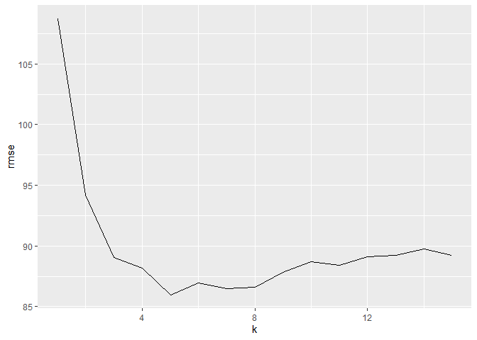<!-- -->

``` r
which.min(rmse$rmse)
```

    ## [1] 5

The best k is 5, which is 85.98209

    c. Using the validation RMSE compare to the best linear regression model from homework 1. 
    Is there an improvement in prediction performance?  
    Interpret your results based on the bias-variance tradeoff.

RMSE is greater for knn method compared to the linear regression model
in hw1, which does not improve the prediction performance. It might be
caused by paying much attention to the training model and hence result
in a high variance and hence perform not very well in generaliztion on
the data which have never seen before(overfitting).

<br>

2.  The goal of this exercise is to fit several LDA classifiers and
    perform model selection using the Ischemic Stroke data set. For your
    convenience the code to pre-process/transform the data is provided
    below.

**Dataset notes:** According to the Mayo Clinic, “ischemic stroke occurs
when a blood clot blocks or narrows an artery leading to the brain. A
blood clot often forms in arteries damaged by the buildup of plaques
(atherosclerosis). It can occur in the carotid artery of the neck as
well as other arteries. This is the most common type of stroke.”
(<https://www.mayoclinic.org/diseases-conditions/stroke/symptoms-causes/syc-20350113#>:\~:text=Ischemic%20stroke%20occurs%20when%20a,most%20common%20type%20of%20stroke.)

1.  Read in the data and convert all categorical variables to factors
    (use code below). Split the data into a training (70%) and
    validation (30%) using stratified dampling (use code below). Using
    the training data, graphically assess each of the predictors using a
    boxplot for quantitative predictors and a mosaic plot for a
    categorical predictors. Note: you can use plot to get these graphs.
    Use for example
    `boxplot(your_predictor ~ Stroke, data=stroke_train)` to get a
    boxplot for a quantitative predictor and
    `plot(Stroke, your_predictor, data=stroke_train)` for a categorical
    predictor to get a mosaic plot. Visually determine the 3 most most
    predictive **imaging features**, i.e. the imaging features that best
    separate the stroke=YES vs. stroke=‘No’ classes. (This is an
    informal procedure since a visual assessment is inherently
    subjective, in a future class we will learn how to do feature
    selection in a systematic way). When splitting the data into
    training, validation and testing or classification problems it is
    important to ensure each set retains approximately the same
    proportion of positive and negative examples as the full data. Split
    the data into training (70%), and validation (30%), but keeping the
    proportion of positive and negative examples roughly the same in the
    training and validation sets. This can be accomplished by sampling
    in a stratified manner, i.e. sampling 70/30 within the negative and
    the positive classes. Use the code below to perform stratified
    splitting.

``` r
stroke <- read.csv("stroke.csv")
stroke$Stroke <- factor(stroke$Stroke, levels=c('N','Y'), labels=c("No", "Yes"))
stroke$NASCET <- factor(stroke$NASCET, levels=0:1, labels=c("No", "Yes"))
stroke$sex <- factor(stroke$sex, levels=0:1, labels=c("Female", "Male"))
stroke$SmokingHistory <- factor(stroke$SmokingHistory, levels=0:1, labels=c("No", "Yes"))
stroke$AtrialFibrillation <- factor(stroke$AtrialFibrillation, levels=0:1, labels=c("No", "Yes"))
stroke$CoronaryArteryDisease <- factor(stroke$CoronaryArteryDisease, levels=0:1, labels=c("No", "Yes"))
```

``` r
n <- nrow(stroke)
positives <- (1:n)[stroke$Stroke=='Yes']
negatives <- (1:n)[stroke$Stroke=='No']

set.seed(2022)
positives_train <- sample(positives, floor(0.7*length(positives)))
positives_val <- setdiff(positives, positives_train)

negatives_train <- sample(negatives, floor(0.7*length(negatives)))
negatives_val <- setdiff(negatives, negatives_train)

stroke_train <- stroke[c(positives_train, negatives_train), ]
stroke_val <- stroke[c(positives_val, negatives_val), ]

ntrain <- nrow(stroke_train); nval <- nrow(stroke_val)

table(stroke_train$Stroke)
```

    ## 
    ##  No Yes 
    ##  43  44

``` r
table(stroke_val$Stroke)
```

    ## 
    ##  No Yes 
    ##  19  20

``` r
boxplot(CALCVol~Stroke, data = stroke_train)
```

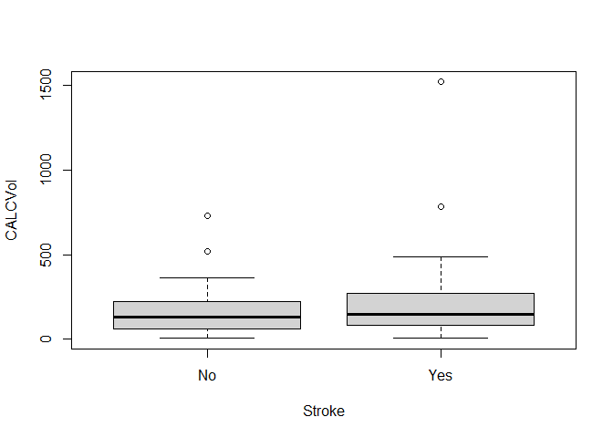<!-- -->

``` r
boxplot(CALCVolProp~Stroke, data = stroke_train)
```

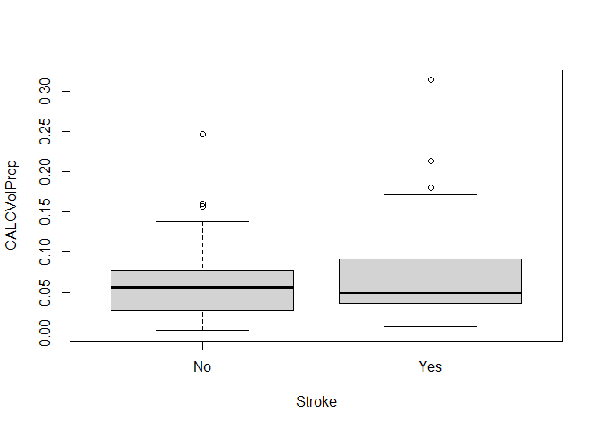<!-- -->

``` r
boxplot(MATXVol~Stroke, data = stroke_train)
```

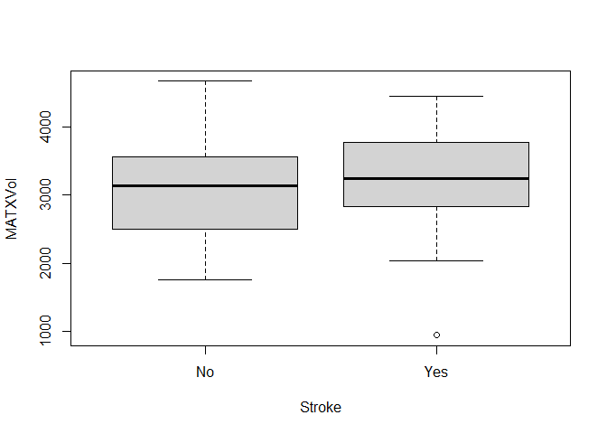<!-- -->

``` r
boxplot(MATXVolProp~Stroke, data = stroke_train)
```

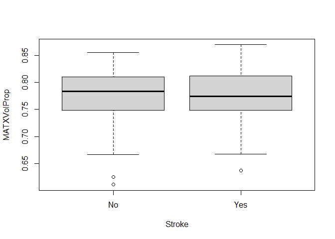<!-- -->

``` r
boxplot(LRNCVol~Stroke, data = stroke_train)
```

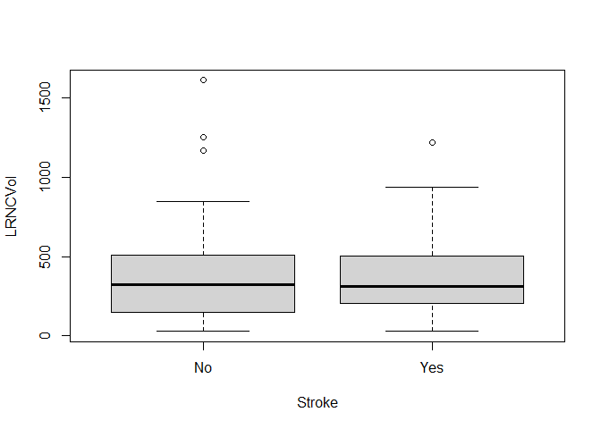<!-- -->

``` r
boxplot(LRNCVolProp~Stroke, data = stroke_train)
```

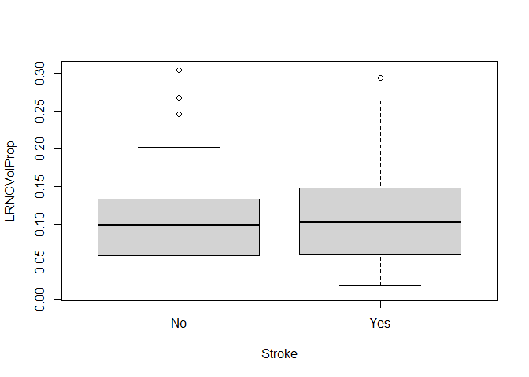<!-- -->

``` r
boxplot(MaxCALCArea~Stroke, data = stroke_train)
```

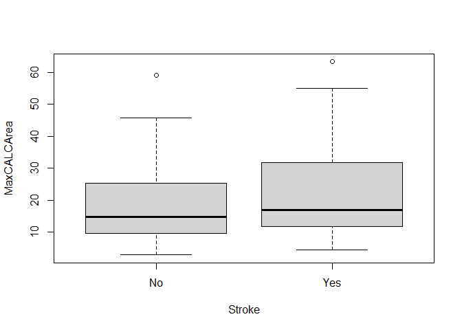<!-- -->

``` r
boxplot(MaxCALCAreaProp~Stroke, data = stroke_train)
```

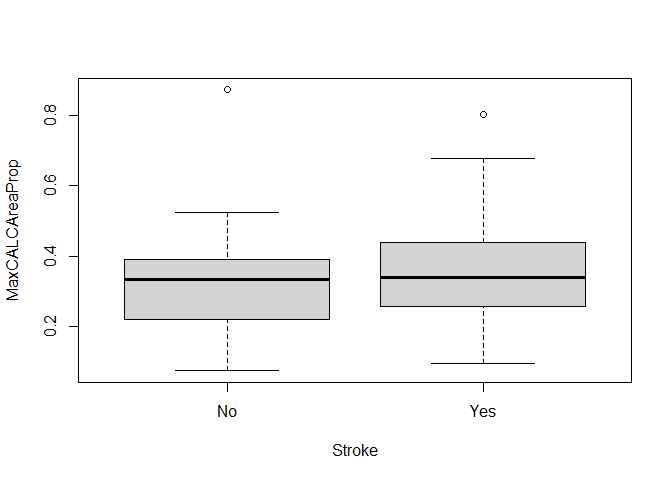<!-- -->

``` r
boxplot(MaxDilationByArea~Stroke, data = stroke_train)
```

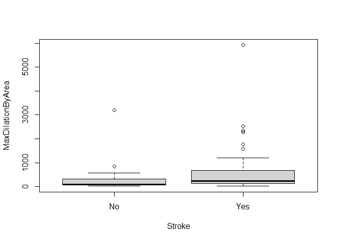<!-- -->

``` r
boxplot(MaxMATXArea~Stroke, data = stroke_train)
```

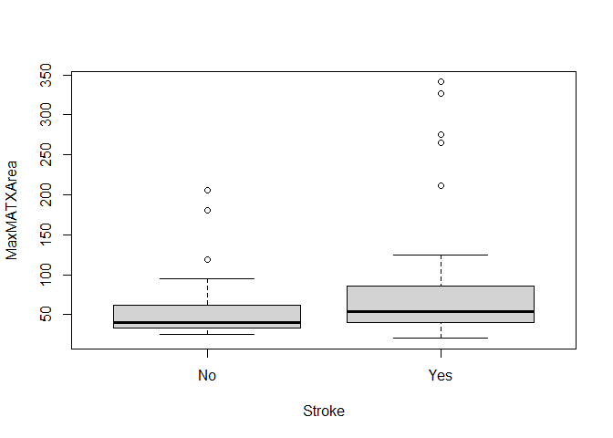<!-- -->

``` r
boxplot(MaxMATXAreaProp~Stroke, data = stroke_train)
```

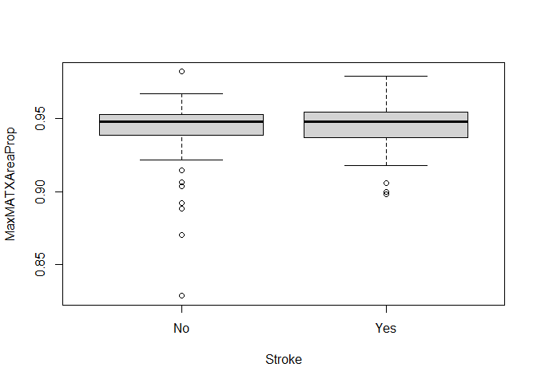<!-- -->

``` r
boxplot(MaxLRNCArea~Stroke, data = stroke_train)
```

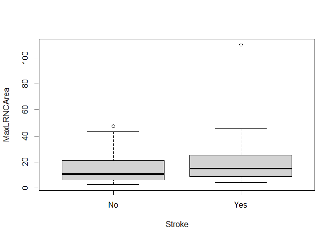<!-- -->

``` r
boxplot(MaxMaxWallThickness~Stroke, data = stroke_train)
```

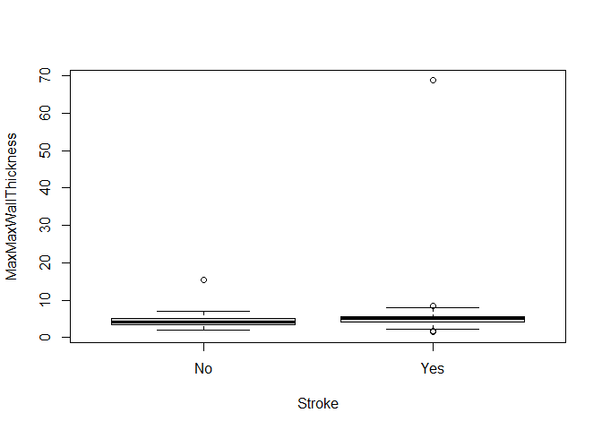<!-- -->

``` r
boxplot(MaxRemodelingRatio~Stroke, data = stroke_train)
```

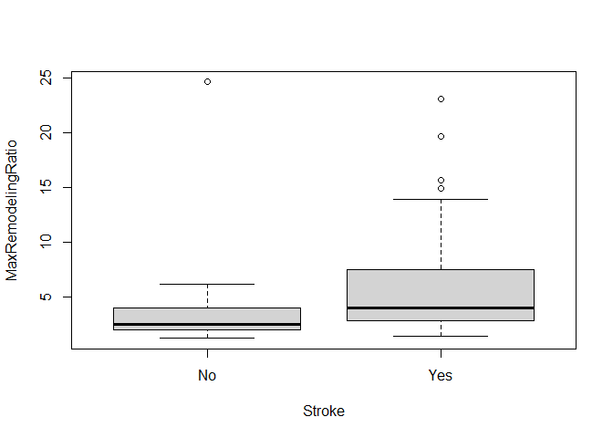<!-- -->

``` r
boxplot(MaxStenosisByArea~Stroke, data = stroke_train)
```

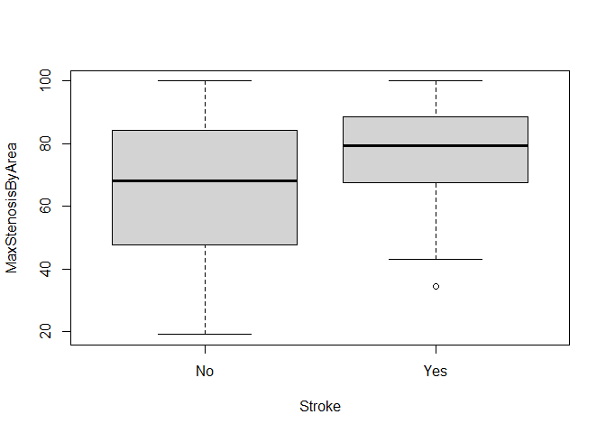<!-- -->

``` r
boxplot(MaxWallArea~Stroke, data = stroke_train)
```

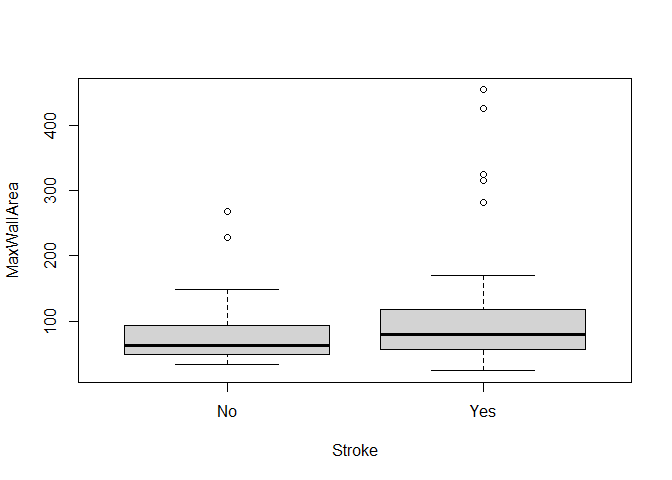<!-- -->

``` r
boxplot(WallVol~Stroke, data = stroke_train)
```

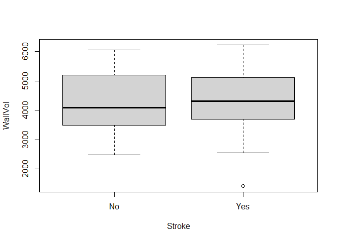<!-- -->

``` r
boxplot(MaxStenosisByDiameter~Stroke, data = stroke_train)
```

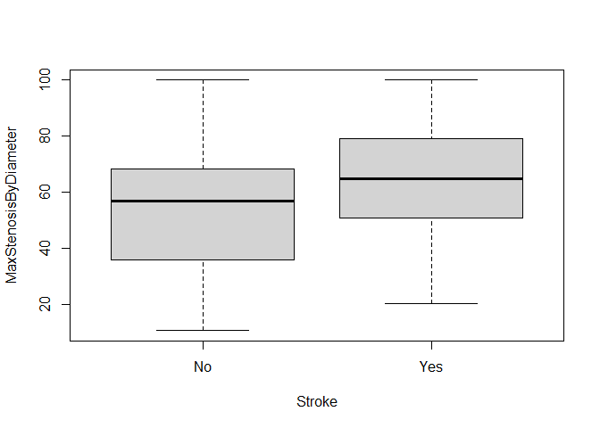<!-- -->

``` r
boxplot(age~Stroke, data = stroke_train)
```

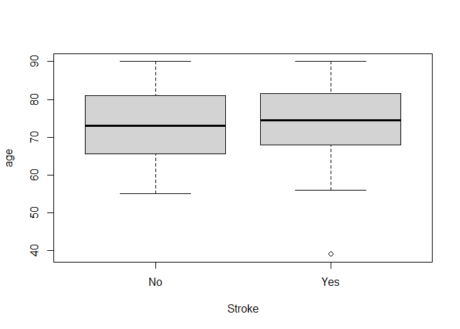<!-- -->

``` r
mosaicplot(Stroke~sex, data = stroke_train)
```

<!-- -->

``` r
mosaicplot(Stroke~SmokingHistory, data = stroke_train)
```

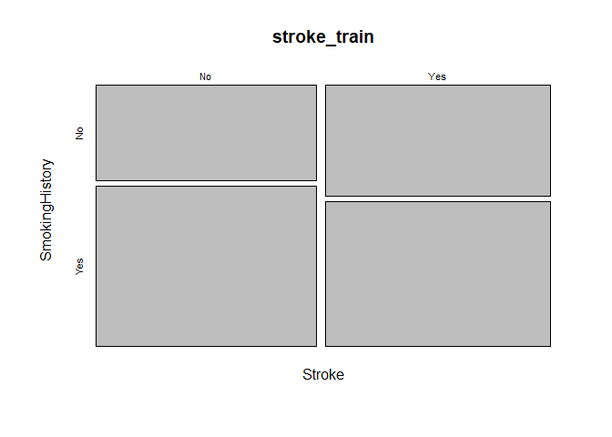<!-- -->

``` r
mosaicplot(Stroke~AtrialFibrillation, data = stroke_train)
```

<!-- -->

``` r
mosaicplot(Stroke~CoronaryArteryDisease, data = stroke_train)
```

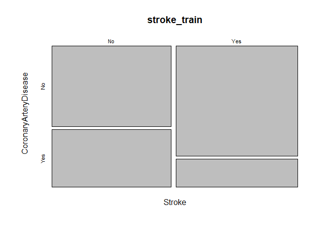<!-- -->

``` r
mosaicplot(Stroke~DiabetesHistory, data = stroke_train)
```

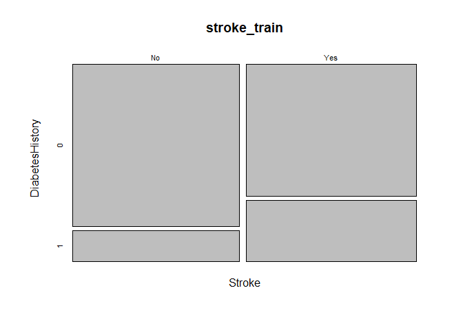<!-- -->

``` r
mosaicplot(Stroke~HypercholesterolemiaHistory, data = stroke_train)
```

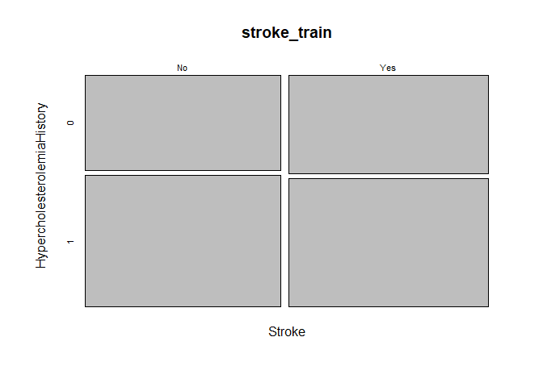<!-- -->

``` r
mosaicplot(Stroke~HypertensionHistory, data = stroke_train)
```

<!-- --> Note: Because of
the moderate sample size we will not have a separate test set – we will
learn later in the course about cross-validation, which will allow us to
split the data into training and testing only and still perform model
selection.

By excluding all the clinical variables, I choose MaxStenosisByArea,
*MaxMaxWallThickness* and MATXVol

2.  Build LDA classifiers of increasing complexity by including: i) age,
    sex, and smoking history; ii) all the previous features + the
    clinical variables AtrialFibrillation, CoronaryArteryDisease,
    DiabetesHistory, HypercholesterolemiaHistory, and
    HypertensionHistory; iii) all the previous features + the most
    predictive imaging feature based on part b; and iv) all the previous
    features + the next 2 most predictive imaging features.

``` r
library(MASS) 
# i
stroke_lda1 <- lda(Stroke ~ age + sex + SmokingHistory , data=stroke_train)
stroke_lda1
```

    ## Call:
    ## lda(Stroke ~ age + sex + SmokingHistory, data = stroke_train)
    ## 
    ## Prior probabilities of groups:
    ##        No       Yes 
    ## 0.4942529 0.5057471 
    ## 
    ## Group means:
    ##          age   sexMale SmokingHistoryYes
    ## No  72.90698 0.4883721         0.6279070
    ## Yes 73.68182 0.6818182         0.5681818
    ## 
    ## Coefficients of linear discriminants:
    ##                            LD1
    ## age                0.009277419
    ## sexMale            1.944593980
    ## SmokingHistoryYes -0.618088265

``` r
# ii
stroke_lda2 <- lda(Stroke ~ age + sex + SmokingHistory + AtrialFibrillation + CoronaryArteryDisease + DiabetesHistory + HypercholesterolemiaHistory + HypertensionHistory, data=stroke_train)
stroke_lda2
```

    ## Call:
    ## lda(Stroke ~ age + sex + SmokingHistory + AtrialFibrillation + 
    ##     CoronaryArteryDisease + DiabetesHistory + HypercholesterolemiaHistory + 
    ##     HypertensionHistory, data = stroke_train)
    ## 
    ## Prior probabilities of groups:
    ##        No       Yes 
    ## 0.4942529 0.5057471 
    ## 
    ## Group means:
    ##          age   sexMale SmokingHistoryYes AtrialFibrillationYes
    ## No  72.90698 0.4883721         0.6279070            0.06976744
    ## Yes 73.68182 0.6818182         0.5681818            0.15909091
    ##     CoronaryArteryDiseaseYes DiabetesHistory HypercholesterolemiaHistory
    ## No                 0.4186047       0.1627907                   0.5813953
    ## Yes                0.2045455       0.3181818                   0.5681818
    ##     HypertensionHistory
    ## No            0.7906977
    ## Yes           0.7500000
    ## 
    ## Coefficients of linear discriminants:
    ##                                     LD1
    ## age                          0.03553658
    ## sexMale                      0.98985630
    ## SmokingHistoryYes            0.13839435
    ## AtrialFibrillationYes        0.82009990
    ## CoronaryArteryDiseaseYes    -1.62459943
    ## DiabetesHistory              1.27744874
    ## HypercholesterolemiaHistory -0.14364500
    ## HypertensionHistory         -0.69398193

``` r
# iii
stroke_lda3 <- lda(Stroke ~ age + sex + SmokingHistory + AtrialFibrillation + CoronaryArteryDisease + DiabetesHistory + HypercholesterolemiaHistory + HypertensionHistory + MaxMaxWallThickness, data=stroke_train)
stroke_lda3
```

    ## Call:
    ## lda(Stroke ~ age + sex + SmokingHistory + AtrialFibrillation + 
    ##     CoronaryArteryDisease + DiabetesHistory + HypercholesterolemiaHistory + 
    ##     HypertensionHistory + MaxMaxWallThickness, data = stroke_train)
    ## 
    ## Prior probabilities of groups:
    ##        No       Yes 
    ## 0.4942529 0.5057471 
    ## 
    ## Group means:
    ##          age   sexMale SmokingHistoryYes AtrialFibrillationYes
    ## No  72.90698 0.4883721         0.6279070            0.06976744
    ## Yes 73.68182 0.6818182         0.5681818            0.15909091
    ##     CoronaryArteryDiseaseYes DiabetesHistory HypercholesterolemiaHistory
    ## No                 0.4186047       0.1627907                   0.5813953
    ## Yes                0.2045455       0.3181818                   0.5681818
    ##     HypertensionHistory MaxMaxWallThickness
    ## No            0.7906977            4.423774
    ## Yes           0.7500000            6.357806
    ## 
    ## Coefficients of linear discriminants:
    ##                                     LD1
    ## age                          0.03984979
    ## sexMale                      0.78563546
    ## SmokingHistoryYes            0.13307674
    ## AtrialFibrillationYes        0.74454187
    ## CoronaryArteryDiseaseYes    -1.74374210
    ## DiabetesHistory              1.25924916
    ## HypercholesterolemiaHistory -0.20914049
    ## HypertensionHistory         -0.75094421
    ## MaxMaxWallThickness          0.07244522

``` r
# iiii
stroke_lda4 <- lda(Stroke ~ age + sex + SmokingHistory + AtrialFibrillation + CoronaryArteryDisease + DiabetesHistory + HypercholesterolemiaHistory + HypertensionHistory + MaxMaxWallThickness + MaxStenosisByArea + MATXVol, data=stroke_train)
stroke_lda4
```

    ## Call:
    ## lda(Stroke ~ age + sex + SmokingHistory + AtrialFibrillation + 
    ##     CoronaryArteryDisease + DiabetesHistory + HypercholesterolemiaHistory + 
    ##     HypertensionHistory + MaxMaxWallThickness + MaxStenosisByArea + 
    ##     MATXVol, data = stroke_train)
    ## 
    ## Prior probabilities of groups:
    ##        No       Yes 
    ## 0.4942529 0.5057471 
    ## 
    ## Group means:
    ##          age   sexMale SmokingHistoryYes AtrialFibrillationYes
    ## No  72.90698 0.4883721         0.6279070            0.06976744
    ## Yes 73.68182 0.6818182         0.5681818            0.15909091
    ##     CoronaryArteryDiseaseYes DiabetesHistory HypercholesterolemiaHistory
    ## No                 0.4186047       0.1627907                   0.5813953
    ## Yes                0.2045455       0.3181818                   0.5681818
    ##     HypertensionHistory MaxMaxWallThickness MaxStenosisByArea  MATXVol
    ## No            0.7906977            4.423774          66.74910 3109.533
    ## Yes           0.7500000            6.357806          76.84884 3198.098
    ## 
    ## Coefficients of linear discriminants:
    ##                                       LD1
    ## age                          3.166462e-02
    ## sexMale                      5.424235e-01
    ## SmokingHistoryYes            1.882595e-01
    ## AtrialFibrillationYes        6.502248e-01
    ## CoronaryArteryDiseaseYes    -1.690986e+00
    ## DiabetesHistory              1.114796e+00
    ## HypercholesterolemiaHistory -2.008705e-01
    ## HypertensionHistory         -7.187020e-01
    ## MaxMaxWallThickness          5.200280e-02
    ## MaxStenosisByArea            2.562632e-02
    ## MATXVol                      6.868736e-05

3.  Write an R function `classificationError` to compute the overall
    misclassification error, specificity, and sensitivity of a
    classifier. The function should take a confusion matrix as its input
    (which you can create using `table` as shown in the lecture) and
    return a vector with the overall misclassication error, specificity
    and sensitivity. (Hint: separately compute the three quantities
    `error`, `spec`, and `sens` inside the body of the function and then
    put them together in a vector using
    `c(error=error, sensitivity=sens, specificity=spec)` in the last
    line of the body of the function before the closing `}` – the last
    line is by default what a function returns. The returned object can
    be any R object including a siggle number, a vector, a data.frame or
    even another function!)

``` r
classificationError <- function(confMatrix){
  error <- (confMatrix[1,2] + confMatrix[2,1])/(confMatrix[1,2] + confMatrix[2,1]+confMatrix[1,1] + confMatrix[2,2])
  spec <- confMatrix[1,1]/(confMatrix[1,2]+confMatrix[1,1])
  sens <- confMatrix[2,2]/(confMatrix[2,1]+confMatrix[2,2])
  c(error=error, sensitiviry=sens, specificity=spec)
}
```

4.  Compute the training and test errors for each of the classifiers
    in e. Which classifier would you choose?

``` r
# model1
pred_train1 <- predict(stroke_lda1, newdata=stroke_train)
confMatrix1_train <- table(true=stroke_train$Stroke, predicted=pred_train1$class)
error_train1 <- classificationError(confMatrix1_train)
pred_val1 <- predict(stroke_lda1, newdata=stroke_val)
confMatrix1_val <- table(true=stroke_val$Stroke, predicted=pred_val1$class)
error_val1 <- classificationError(confMatrix1_val)
error_train1
```

    ##       error sensitiviry specificity 
    ##   0.4022989   0.6818182   0.5116279

``` r
error_val1
```

    ##       error sensitiviry specificity 
    ##   0.6153846   0.4000000   0.3684211

``` r
# model2
pred_train2 <- predict(stroke_lda2, newdata=stroke_train)
confMatrix2_train <- table(true=stroke_train$Stroke, predicted=pred_train2$class)
error_train2 <- classificationError(confMatrix2_train)
pred_val2 <- predict(stroke_lda2, newdata=stroke_val)
confMatrix2_val <- table(true=stroke_val$Stroke, predicted=pred_val2$class)
error_val2 <- classificationError(confMatrix2_val)
error_train2
```

    ##       error sensitiviry specificity 
    ##   0.3103448   0.7045455   0.6744186

``` r
error_val2
```

    ##       error sensitiviry specificity 
    ##   0.5384615   0.3500000   0.5789474

``` r
# model3
pred_train3 <- predict(stroke_lda3, newdata=stroke_train)
confMatrix3_train <- table(true=stroke_train$Stroke, predicted=pred_train3$class)
error_train3 <- classificationError(confMatrix3_train)
pred_val3 <- predict(stroke_lda3, newdata=stroke_val)
confMatrix3_val <- table(true=stroke_val$Stroke, predicted=pred_val3$class)
error_val3 <- classificationError(confMatrix3_val)
error_train3
```

    ##       error sensitiviry specificity 
    ##   0.3103448   0.7272727   0.6511628

``` r
error_val3
```

    ##       error sensitiviry specificity 
    ##   0.4358974   0.5000000   0.6315789

``` r
# model4
pred_train4 <- predict(stroke_lda4, newdata=stroke_train)
confMatrix4_train <- table(true=stroke_train$Stroke, predicted=pred_train4$class)
error_train4 <- classificationError(confMatrix4_train)
pred_val4 <- predict(stroke_lda4, newdata=stroke_val)
confMatrix4_val <- table(true=stroke_val$Stroke, predicted=pred_val4$class)
error_val4 <- classificationError(confMatrix4_val)
error_train4
```

    ##       error sensitiviry specificity 
    ##   0.3218391   0.6590909   0.6976744

``` r
error_val4
```

    ##       error sensitiviry specificity 
    ##   0.4102564   0.6000000   0.5789474

``` r
error_train <- c(error_train1[1], error_train2[1], error_train3[1],error_train4[1])
error_val <- c(error_val1[1], error_val2[1], error_val3[1],error_val4[1])
complexity <- c(1,2,3,4)
error <- data.frame(error_train, error_val, complexity)
error
```

    ##   error_train error_val complexity
    ## 1   0.4022989 0.6153846          1
    ## 2   0.3103448 0.5384615          2
    ## 3   0.3103448 0.4358974          3
    ## 4   0.3218391 0.4102564          4

I will choose the fourth one with less error validation set

5.  Plot in the same graph the training and test misclassification error
    as a function of classifier complexity. Comment/interpret the plots.

``` r
library(ggplot2)
ggplot(data = error) +
  geom_line(mapping = aes(x = complexity, y = error_train, color = "error_train")) +
  geom_line(mapping = aes(x = complexity, y = error_val, color = "error_val")) +
  labs(x = "classifier complexity", y = "misclassification error")
```

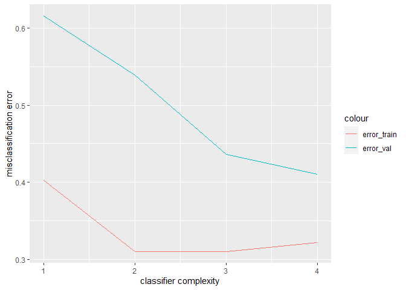<!-- -->

As complexity increases, the misclassification errors validation set
decreases, which shows that the fourth model is the best one.
