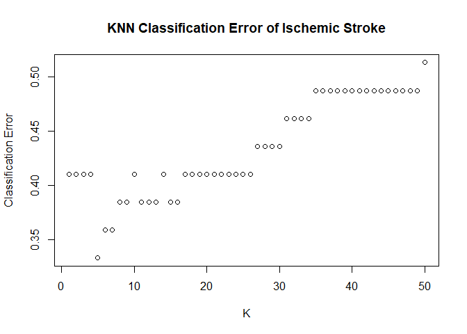
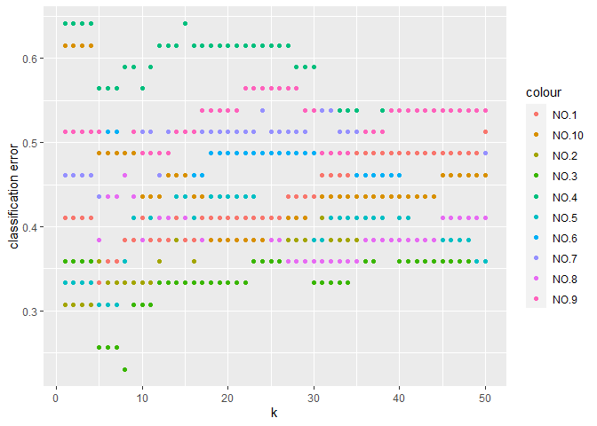
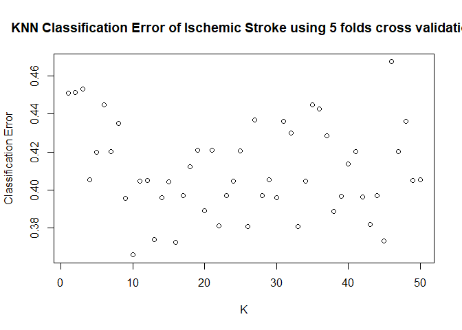
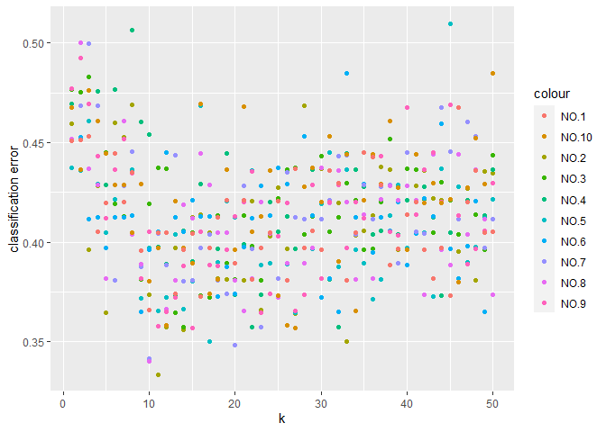
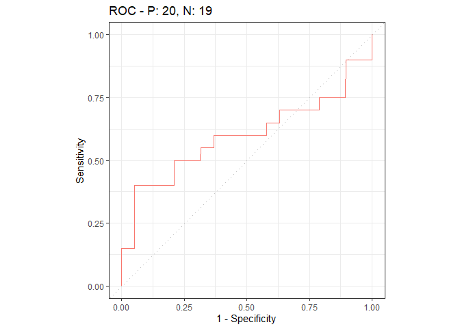
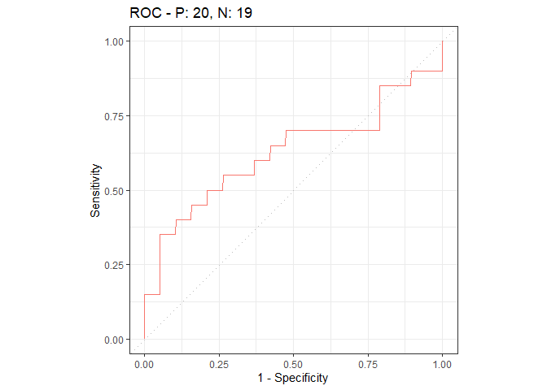

PM 591 Assignment3
================
Nicky Nie
2/24/2022

<br>

Exercise 1

1.  Build a KNN classifier to predict stroke using the ischemic stroke
    data and tune the complexity parameter  *K* = 1, …, 50 using a
    single-split validation set. As features use “sex”, “age”,
    “CoronaryArteryDisease”, “MaxStenosisByDiameter” and “MATXVolProp”).
    Plot the classification error as a function of  *K*. Which value of
    *K* do you choose? Explain.

``` r
library(mlr3)

stroke = read.csv("stroke.csv")

stroke$Stroke                      <- factor(stroke$Stroke, levels=c('N', 'Y'), labels=c("No", "Yes"))
stroke$NASCET                      <- factor(stroke$NASCET, labels=c("No", "Yes"))
stroke$sex                         <- factor(stroke$sex, labels=c("Female", "Male"))
stroke$SmokingHistory              <- factor(stroke$SmokingHistory, labels=c("No", "Yes"))
stroke$AtrialFibrillation          <- factor(stroke$AtrialFibrillation, labels=c("No", "Yes"))
stroke$CoronaryArteryDisease       <- factor(stroke$CoronaryArteryDisease, labels=c("No", "Yes"))
stroke$DiabetesHistory             <- factor(stroke$DiabetesHistory, labels=c("No", "Yes"))
stroke$HypercholesterolemiaHistory <- factor(stroke$HypercholesterolemiaHistory, labels=c("No", "Yes"))
stroke$HypertensionHistory         <- factor(stroke$HypertensionHistory, labels=c("No", "Yes"))
```

``` r
set.seed(303)
n = nrow(stroke)
positives = (1:n)[stroke$Stroke=='Yes']
negatives = (1:n)[stroke$Stroke=='No']

positives_train = sample(positives, floor(0.7*length(positives)))
positives_val = setdiff(positives, positives_train)

negatives_train = sample(negatives, floor(0.7*length(negatives)))
negatives_val = setdiff(negatives, negatives_train)

rowstrain = c(positives_train, negatives_train)
rowsval = c(positives_val, negatives_val)

stroke_train = stroke[c(positives_train, negatives_train), ]
stroke_val = stroke[c(positives_val, negatives_val), ]

ntrain = nrow(stroke_train); nval=nrow(stroke_val)
```

``` r
stroke.tsk  <- as_task_classif(stroke,
                              target = "Stroke",
                              positive = "Yes",
                              id = "Ischemic Stroke") 

stroke.tsk$select(c("sex", "age", "CoronaryArteryDisease", "MaxStenosisByDiameter", "MATXVolProp"))
```

``` r
library(mlr3learners) 
library(kknn) 
suppressMessages(library(MASS))

stroke_sensitivity <- numeric(50)
stroke_specificity <- numeric(50)
stroke_ce          <- numeric(50)
stroke_acc         <- numeric(50)

for (i in 1:50) {
  stroke.lrn <- lrn("classif.kknn", k = i)
  
  stroke.lrn$train(stroke.tsk, row_ids=rowstrain)
  
  stroke_predict <- stroke.lrn$predict(stroke.tsk, row_ids = rowsval)
  stroke_sensitivity[i] <- stroke_predict$score(msr("classif.sensitivity"))
  stroke_specificity[i] <- stroke_predict$score(msr("classif.specificity"))
  stroke_ce[i]  <- stroke_predict$score(msr("classif.ce"))
  stroke_acc[i] <- stroke_predict$score(msr("classif.acc"))
}

k = c(1:50)
plot(x = k, y = stroke_ce, 
     main = "KNN Classification Error of Ischemic Stroke", xlab = "K", ylab = "Classification Error")
```

<!-- --> I will choose k=16
since the sequence of data with ce=0.3846154 gives a more convincing low
ce compared to those with lower ce but only three points shown in the
plot. And among those with 0.3846154 ce, k=16 provides the simplist
model.

2.  Repeat a) 9 additional times with different random
    training/validation splits (use a loop). Plot the 10 curves, analogs
    to the one obtained in a. in the same graph. Do you choose the same
    value of  *K* for each of the 10 splits? What does this say about
    the stability/variability of using a single training/validation
    split to perform model selection?

``` r
sensitivity <- matrix(nrow = 50, ncol = 9)
specificity <- matrix(nrow = 50, ncol = 9)
ce          <- matrix(nrow = 50, ncol = 9)
acc         <- matrix(nrow = 50, ncol = 9)
for (i in 1:9){
  positives_train = sample(positives, floor(0.7*length(positives)))
  positives_val = setdiff(positives, positives_train)

  negatives_train = sample(negatives, floor(0.7*length(negatives)))
  negatives_val = setdiff(negatives, negatives_train)

  rowstrain = c(positives_train, negatives_train)
  rowsval = c(positives_val, negatives_val)

  stroke_train = stroke[c(positives_train, negatives_train), ]
  stroke_val = stroke[c(positives_val, negatives_val), ]
  
  for (j in 1:50) {
    stroke.lrn <- lrn("classif.kknn", k = j)
  
    stroke.lrn$train(stroke.tsk, row_ids=rowstrain)
  
    stroke_predict <- stroke.lrn$predict(stroke.tsk, row_ids = rowsval)
    sensitivity[j,i] <- stroke_predict$score(msr("classif.sensitivity"))
    specificity[j,i] <- stroke_predict$score(msr("classif.specificity"))
    ce[j,i]  <- stroke_predict$score(msr("classif.ce"))
    acc[j,i] <- stroke_predict$score(msr("classif.acc"))
  }
}
```

``` r
suppressMessages(library(ggplot2))
ce_10 <- data.frame(ce, stroke_ce, k)
plot1 <- ggplot(data = ce_10)+
  geom_point(mapping = aes(x = k, y = X1, color="NO.2"))+
  geom_point(mapping = aes(x = k, y = X2, color="NO.3"))+
  geom_point(mapping = aes(x = k, y = X3, color="NO.4"))+
  geom_point(mapping = aes(x = k, y = X4, color="NO.5"))+
  geom_point(mapping = aes(x = k, y = X5, color="NO.6"))+
  geom_point(mapping = aes(x = k, y = X6, color="NO.7"))+
  geom_point(mapping = aes(x = k, y = X7, color="NO.8"))+
  geom_point(mapping = aes(x = k, y = X8, color="NO.9"))+
  geom_point(mapping = aes(x = k, y = X9, color="NO.10"))+
  geom_point(mapping = aes(x = k, y = stroke_ce, color="NO.1"))+
  labs(x = "k", y = "classification error")
plot1
```

<!-- --> I don’t choose the
same k for different split and the difference is great for different
choices, hence I think this kind of training/validation set split is
unstable for us to choose the optimistic model.

3.  Now tune the complexity parameter  *K* = 1, …, 50 using now 5-fold
    cross-validation instead of a single training/validation split.
    Which value of *k* do you choose? Explain.

``` r
set.seed(202)

lgr::get_logger("mlr3")$set_threshold("warn")    
lgr::get_logger("bbotk")$set_threshold("warn")

stroke.cv_ce <- numeric(50)

for (i in 1:50) {
  knn.lrn <- lrn("classif.kknn", k = i)
  
  cv <- rsmp("cv", folds = 5)
  stroke.rr <- resample(stroke.tsk, knn.lrn, cv, store_models = TRUE)

  # accuracy and classification error
  stroke.cv_ce[i]  <- stroke.rr$aggregate(msr("classif.ce"))
}

plot(x = k, y = stroke.cv_ce, 
     main = "KNN Classification Error of Ischemic Stroke using 5 folds cross validation", xlab = "K", ylab = "Classification Error")
```

<!-- --> I will choose the
k=10 since it provides the lowest classification error.

4.  Repeat c) 9 additional times with different cross-validation splits
    (use a loop). Plot the 10 curves, analogs to the one obtained in
    c. in the same graph. Do you choose the same value of  *K* for each
    of the 10 splits? What does this say about the stability/variability
    of using cross/validation to perform model selection compared to a
    single split?

``` r
ce2 <- matrix(nrow = 50, ncol = 9)
for (i in 1:9){
  positives_train = sample(positives, floor(0.7*length(positives)))
  positives_val = setdiff(positives, positives_train)

  negatives_train = sample(negatives, floor(0.7*length(negatives)))
  negatives_val = setdiff(negatives, negatives_train)

  rowstrain = c(positives_train, negatives_train)
  rowsval = c(positives_val, negatives_val)

  stroke_train = stroke[c(positives_train, negatives_train), ]
  stroke_val = stroke[c(positives_val, negatives_val), ]

  for (j in 1:50) {
  knn.lrn <- lrn("classif.kknn", k = j)
  
  cv <- rsmp("cv", folds = 5)
  stroke.rr <- resample(stroke.tsk, knn.lrn, cv, store_models = TRUE)

  # accuracy and classification error
  ce2[j,i]  <- stroke.rr$aggregate(msr("classif.ce"))
}
}
```

``` r
ce2_10 <- data.frame(ce2, stroke.cv_ce, k)
plot2 <- ggplot(data = ce2_10)+
  geom_point(mapping = aes(x = k, y = X1, color="NO.2"))+
  geom_point(mapping = aes(x = k, y = X2, color="NO.3"))+
  geom_point(mapping = aes(x = k, y = X3, color="NO.4"))+
  geom_point(mapping = aes(x = k, y = X4, color="NO.5"))+
  geom_point(mapping = aes(x = k, y = X5, color="NO.6"))+
  geom_point(mapping = aes(x = k, y = X6, color="NO.7"))+
  geom_point(mapping = aes(x = k, y = X7, color="NO.8"))+
  geom_point(mapping = aes(x = k, y = X8, color="NO.9"))+
  geom_point(mapping = aes(x = k, y = X9, color="NO.10"))+
  geom_point(mapping = aes(x = k, y = stroke.cv_ce, color="NO.1"))+
  labs(x = "k", y = "classification error")
plot2
```

<!-- --> Although the
choices differ for some splits, most I choose is k=10 or around 10, so
cross validation is more stable to prform model selection than the
single split.

Exercise 2.

Using the ischemic stroke data with the same features than in exercise
1, train an evaluate the performance of an LDA, QDA, and logistic
regression classifiers using the mlr3 package. Plot the ROC curve and
report the AUC for each of the classifiers. Compare the performance of
the three classifiers. Which one would you choose for predicting stroke?

``` r
set.seed(303)
n = nrow(stroke)
positives = (1:n)[stroke$Stroke=='Yes']
negatives = (1:n)[stroke$Stroke=='No']

positives_train = sample(positives, floor(0.7*length(positives)))
positives_val = setdiff(positives, positives_train)

negatives_train = sample(negatives, floor(0.7*length(negatives)))
negatives_val = setdiff(negatives, negatives_train)

rowstrain = c(positives_train, negatives_train)
rowsval = c(positives_val, negatives_val)

stroke_train = stroke[c(positives_train, negatives_train), ]
stroke_val = stroke[c(positives_val, negatives_val), ]

ntrain = nrow(stroke_train); nval=nrow(stroke_val)
```

``` r
stroke.tsk  <- as_task_classif(stroke,
                              target = "Stroke",
                              positive = "Yes",
                              id = "Ischemic Stroke") 

stroke.tsk$select(c("sex", "age", "CoronaryArteryDisease", "MaxStenosisByDiameter", "MATXVolProp"))
```

``` r
suppressMessages(library(mlr3viz))
suppressMessages(library(GGally))
stroke.lrn1 <- lrn("classif.lda", predict_type = "prob")
stroke.lrn1$train(stroke.tsk, row_ids=rowstrain)
stroke_predict1 <- stroke.lrn1$predict(stroke.tsk, row_ids = rowsval)
autoplot(stroke_predict1, type="roc")
```

<!-- -->

``` r
auc_lda <- stroke_predict1$score(msr("classif.auc"))
```

``` r
stroke.lrn2 <- lrn("classif.qda", predict_type = "prob")
stroke.lrn2$train(stroke.tsk, row_ids=rowstrain)
stroke_predict2 <- stroke.lrn2$predict(stroke.tsk, row_ids = rowsval)
autoplot(stroke_predict2, type="roc")
```

<!-- -->

``` r
auc_qda <- stroke_predict2$score(msr("classif.auc"))
```

``` r
stroke.lrn3 <- lrn("classif.log_reg", predict_type = "prob")
stroke.lrn3$train(stroke.tsk, row_ids=rowstrain)
stroke_predict3 <- stroke.lrn3$predict(stroke.tsk, row_ids = rowsval)
autoplot(stroke_predict3, type="roc")
```

<!-- -->

``` r
auc_log <- stroke_predict3$score(msr("classif.auc"))
```

``` r
auc <- data.frame(auc_lda, auc_qda, auc_log)
auc
```

    ##               auc_lda   auc_qda   auc_log
    ## classif.auc 0.6210526 0.5973684 0.6263158

I would choose logistic regression model since it has the highest value
of auc.
